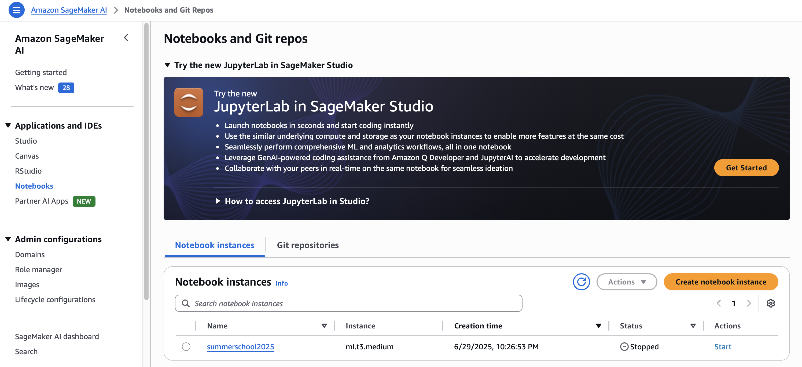
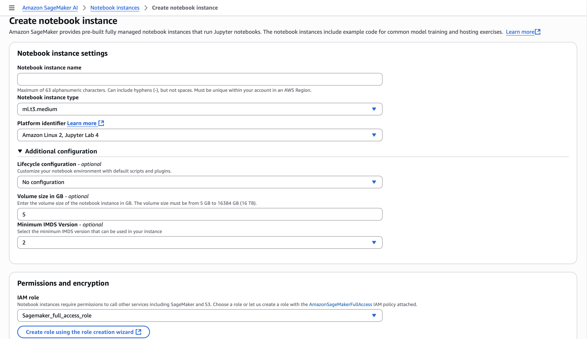
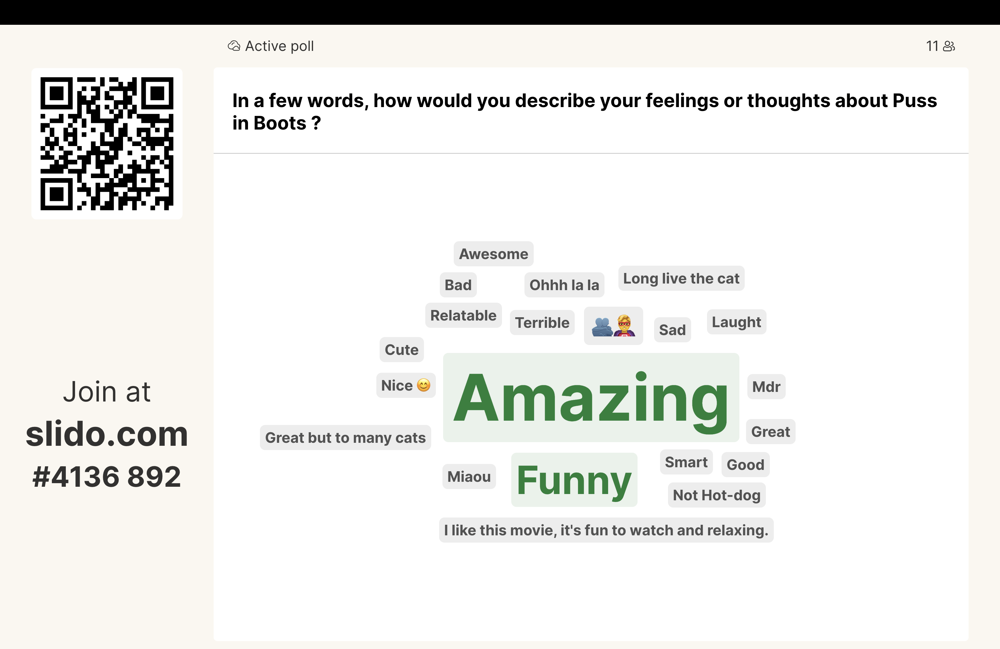

# Hi! PARIS Summer School 2025 - Exploring Machine Learning Deployment from beginner to advanced level 🚀


This repository contains the demos for the **Hi! PARIS Summer School 2025** session on **Exploring Machine Learning Deployment from beginner to advanced level** 🚀.

The repository is divided into three folders, one for each practical demo:
- `streamlit-app/` for the Streamlit demo
- `sagemaker-deployment/` for the AWS SageMaker demo
- `docker-app/` for the Docker + AWS Lambda demo 

This repository was originally created by **Laurène David** for the [Hi! PARIS Summer School 2024](https://github.com/laudavid/ss2024_deploy_app). 
<br>

The session was hosted by  **Awais SANI**, Senior Machine Learning engineer @ Hi! PARIS and **Marguerite LEANG**, Machine Learning engineer @ Hi! PARIS, on 2025, July 9th at Ecole polytechnique.

To learn more about the Hi! PARIS Engineering Team, here are some useful links:
- Github: https://github.com/hi-paris
- Website: https://engineeringteam.hi-paris.fr/

<br> 

## Demo 1: Deploy a Sentiment Analysis app using Streamlit 


### <u>1. Streamlit tutorials</u>
- Deploy a Streamlit app: https://docs.streamlit.io/deploy/streamlit-community-cloud/deploy-your-app
- Manage streamlit secrets: https://docs.streamlit.io/deploy/streamlit-community-cloud/deploy-your-app/secrets-management
- Connect app to external data sources: https://docs.streamlit.io/develop/tutorials/databases
- Deploy an app to HuggingFace spaces: https://medium.com/@imanuelyosi/deploy-your-streamlit-web-app-using-hugging-face-7b9cddb11148
<br>

### <u>2. Terminal commands</u>
Install a virtual environment with `python 3.10` (ensure you have installed `anaconda3`):
```python
conda create --name venv_streamlit python=3.10
```

Activate the virtual environment:
```python
conda activate venv_streamlit
```

Install the packages in the `requirements.txt` in `streamlit-app/`:
```bash
pip install -r streamlit-app/requirements.txt
````

Launch the streamlit app locally <br>
```python 
streamlit run streamlit-app/app.py
```
<br>

Build a `requirements.txt` file to deploy the app via Streamlit Cloud
```python
pip3 freeze > requirements.txt
```
<br>
<br>

## Demo 2: Deploy pre-trained sklearn models with AWS SageMaker 


### <u>1. How to launch a SageMaker notebook instance</u> 

#### Step 1: Create an AWS account
First, you will need to create an AWS account if you don't already have one. <br>
https://aws.amazon.com/?nc1=h_ls

#### Step 2: Go to the Amazon SageMaker AI console and create a notebook instance.

Go to the `Amazon SageMaker AI` console and select the `Notebooks` option on the console's left tab.
To create the notebook, click on **Create notebook instance**.




#### Step 3: Configure the SageMaker notebook instance.

- Select a *notebook instance name*
- Select a *notebook instance type* 
- Select a *platform type* for the notebook instance, for example the JupyterLab version you want to use
- For the IAM role, click on *Create a new role option* then create a role associed to the instance's S3 bucket. 



Most of these configuration can be left with their default value. Only the creation of a new IAM role is mandatory to access the S3 bucket.

In the *Additional configuration* part, you can modify the volume size (in GB) of the notebook instance if needed.

#### Step 4: Launch the notebook instance 
Once you've provided all the required information, you can now launch the notebook (this can take a couple of minutes). To stop the instance from running, click on the notebook instance then select *Stop*. This will be prevent additional costs.

<br>

### <u>2. Using SageMaker endpoint to process results during the course session</u>
During the course session, we asked the audience to vote on Slido and here is the wordcloud:


| Text                                                  | Count |
|-------------------------------------------------------|-------|
| Amazing                                               | 3     |
| Not Hot-dog                                           | 2     |
| Funny                                                 | 2     |
| Ohhh la la                                            | 1     |
| Mdr                                                   | 1     |
| Miaou                                                 | 1     |
| 🫂🦸‍♂️                                                  | 1     |
| Terrible                                              | 1     |
| Awesome                                               | 1     |
| Laught                                                | 1     |
| Relatable                                             | 1     |
| Sad                                                   | 1     |
| Great but to many cats                                | 1     |
| Bad                                                   | 1     |
| Good                                                  | 1     |
| Nice 😊                                               | 1     |
| Great                                                 | 1     |
| Long live the cat                                     | 1     |
| I like this movie, it's fun to watch and relaxing.    | 1     |
| Smart                                                 | 1     |
| Cute                                                  | 1     |


To process the results, we used the AWS SageMaker Endpoint:
```python 
data_slido = [
    "Amazing",
    "Smart",
    "Funny",
    "Long live the cat",
    "Nice 😊",
    "Not Hot-dog",
    "Sad",
    "Relatable",
    "Laught",
    "Terrible",
    "Awesome",
    "🫂🦸‍♂️", 
    "Ohhh la la",
    "Mdr",
    "Miaou",
    "I like this movie, it's fun to watch and relaxing.",
    "Great but too many cats",
    "Great",
    "Good",
    "Bad",
    "Cute"]


def predict_text_list(text_list, predictor):
    """
    Predicts sentiment or label for a list of text inputs using a SageMaker Predictor.
    Args:
        text_list (list of str): List of text entries to predict on.
        predictor (Predictor): A configured SageMaker Predictor with serializer and deserializer.
    Returns:
        list: Model predictions for each input text.
    """
    # Prepare data in the same format as single input
    responses = []
    for text in text_list:
        data_batch = {'text': text}
        # Set up the predictor's serializer/deserializer
        predictor.serializer = JSONSerializer()
        predictor.deserializer = JSONDeserializer()
        # Send to the endpoint
        response = predictor.predict(json.dumps(data_batch))  
        responses.append(response[0])
    return responses

# Run prediction
results = predict_text_list(data_slido, predictor)

# Print results
for text, result in zip(data_slido, results):
    if result=="positive":
        print(f"✅ Input: '{text}' --> Prediction: {result}")
    else:
        print(f"❌ Input: '{text}' --> Prediction: {result}")

```

Here are the results:
```python
✅ Input: 'Amazing' --> Prediction: positive
✅ Input: 'Smart' --> Prediction: positive
✅ Input: 'Funny' --> Prediction: positive
✅ Input: 'Long live the cat' --> Prediction: positive
✅ Input: 'Nice 😊' --> Prediction: positive
✅ Input: 'Not Hot-dog' --> Prediction: positive
✅ Input: 'Sad' --> Prediction: positive
✅ Input: 'Relatable' --> Prediction: positive
✅ Input: 'Laught' --> Prediction: positive
❌ Input: 'Terrible' --> Prediction: negative
✅ Input: 'Awesome' --> Prediction: positive
✅ Input: '🫂🦸‍♂️' --> Prediction: positive
✅ Input: 'Ohhh la la' --> Prediction: positive
✅ Input: 'Mdr' --> Prediction: positive
✅ Input: 'Miaou' --> Prediction: positive
✅ Input: 'I like this movie, it's fun to watch and relaxing.' --> Prediction: positive
✅ Input: 'Great but too many cats' --> Prediction: positive
✅ Input: 'Great' --> Prediction: positive
✅ Input: 'Good' --> Prediction: positive
❌ Input: 'Bad' --> Prediction: negative
✅ Input: 'Cute' --> Prediction: positive

```


Some predictions that are uncorrect or hard to determine if the sentiment is positive or negative: 
```python
✅ Input: 'Not Hot-dog' --> Prediction: positive
✅ Input: 'Sad' --> Prediction: positive
❌ Input: 'Terrible' --> Prediction: negative
```


### <u>3. SageMaker documentation/tutorials</u>
- SageMaker Python SDK documentation: https://sagemaker.readthedocs.io/en/stable/index.html​
- Host a pre-trained model on SageMaker: https://sagemaker-examples.readthedocs.io/en/latest/sagemaker-script-mode/pytorch_bert/deploy_bert_outputs.html
- Using Scikit-learn with the SageMaker Python SDK: https://sagemaker.readthedocs.io/en/stable/frameworks/sklearn/using_sklearn.html#deploy-a-scikit-learn-model
- Boto3 documentation: https://boto3.amazonaws.com/v1/documentation/api/latest/guide/quickstart.html
- Use Docker containers to train and deploy models: https://docs.aws.amazon.com/sagemaker/latest/dg/docker-containers.html

